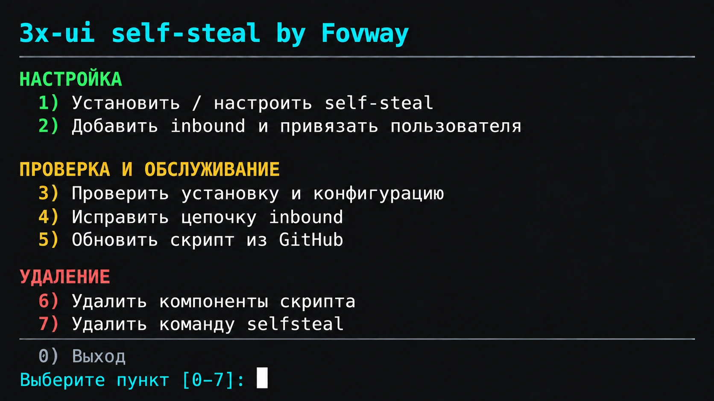

# 3x-ui self-steal by Fovway



Интерактивная настройка self-steal Reality для 3x-ui на Ubuntu/Debian с systemd.

## Установка через curl

Запустите на целевом сервере от пользователя с `sudo`. Переменные заранее задавать не нужно: скрипт интерактивно запросит домен, название сайта и остальные параметры. Вопросы, справка, сообщения об ошибках и результаты установщика выводятся на русском языке.

```bash
curl -fSL https://raw.githubusercontent.com/Fovway/3xui-selfsteal/main/setup-selfsteal-3xui.sh -o /tmp/setup-selfsteal-3xui.sh && sudo bash /tmp/setup-selfsteal-3xui.sh
```

При первом открытии меню скрипт устанавливает себя как `/usr/local/bin/selfsteal`. После этого меню открывается командой:

```bash
sudo selfsteal
```

От пользователя root достаточно `selfsteal`. Установить только команду без настройки сервера можно так: `sudo bash /tmp/setup-selfsteal-3xui.sh --install-script`.

Перед изменениями скрипт проверяет DNS, сервисы и занятость портов. Основная настройка выполняется только после подтверждения `APPLY`. В вопросах `[Y/n]` введите `y` (да) или `n` (нет); Enter выбирает «да». Подтверждения `APPLY`, `INSTALL PREFLIGHT PACKAGES` и `I VERIFIED DNS AND PORT FORWARDING` вводятся точно как показано в подсказке. Вывод внешних программ (apt, nginx, certbot и других) зависит от их языка и настроек системы.

Предварительная проверка без изменений:

```bash
sudo selfsteal --check --domain vpn.example.com
```

Подробная справка:

```bash
bash /tmp/setup-selfsteal-3xui.sh --help
```

## Тестирование скорости VPS

В разделе **3 → Тесты и диагностика VPS** доступны отдельные замеры **Speedtest (Ookla)** (№10) и **LibreSpeed** (№11), альтернативный сервис на случай недоступности Speedtest.net. При первом запуске нужный бинарник скачивается по HTTPS в `/root/selfsteal-3xui/tools/` с проверкой SHA-256 (без установки системных пакетов). Для Ookla при первом запуске может потребоваться принятие лицензии в терминале. LibreSpeed запускается с отключённой телеметрией. Цвет статуса тестов сохраняется, а после тестирования можно создать PNG результата, как и для остальных проверок. Доступность серверов обоих сервисов зависит от сети и региона.

## Аудит маскировки сервера

Раздел **1 → 4 «Аудит маскировки сервера»** (либо `sudo selfsteal --masking-audit`) выполняет локальный аудит без изменения параметров, правил фаервола или перезапуска служб.

Проверяются настройки VLESS/Reality TCP 443, SNI и локальный target, соответствие runtime Xray, TLS-сертификат и его имя, доступность HTTPS-заглушки собственным локальным TLS-запросом, Hysteria 2 на всех обнаруженных UDP-портах, её TLS/ALPN и настройки Salamander, привязка панели 3x-ui к loopback, публикация панели, слушающие TCP/UDP-порты и статус UFW. Для корректной проверки нескольких Hysteria inbound используются их реальные порты, а наличие UDP 443 не считается конфликтом с TCP 443.

Результаты выводятся как **OK**, **WARN**, **FAIL**, **SKIP** и сохраняются в приватный TXT-файл `/root/selfsteal-3xui/audit/` (права 0600). В интерактивном режиме можно по желанию сохранить PNG, **если** уже установлены Pillow и шрифт DejaVu. Сам аудит **ничего не устанавливает**, не пишет ключи, токены и пароли в отчёт и не сканирует чужие узлы. Ошибка проверки не завершает главное меню.

**Ограничение:** проверяются только локальные настройки и собственное HTTPS-поведение сервера. Нельзя по такому отчёту достоверно определить, виден ли сервер ТСПУ или доступен ли он из российских сетей. Статусы WARN могут требовать ручной проверки; скрипт ничего автоматически не исправляет.

## Управление после запуска

Если запустить скрипт без аргументов, открывается главное меню с пятью разделами:

1. **Управление 3x-ui** — показать сохранённый адрес панели, включить/выключить её доступ из интернета, проверить работу сервиса 3x-ui, запустить аудит маскировки.
2. **Настройка Self-Steal** — «Установить», «Создать новый inbound», «Исправить цепочку inbound», «Проверить конфигурацию».
3. **Тесты и диагностика VPS** — все 11 существующих тестов одним списком, включая Ookla Speedtest и LibreSpeed.
4. **Обслуживание скрипта** — проверить наличие новой версии на GitHub, обновить скрипт.
5. **Удаление** — удалить компоненты установки или удалить команду selfsteal.

**0 — Выход.** В каждом подменю пункт **0** возвращает в главное меню. Цвета включаются в терминале; `NO_COLOR=1` отключает их.

При открытии главного меню скрипт проверяет версию в `main` на GitHub (тайм-аут до 6 секунд). Если версия новее установленной, под шапкой появляется уведомление с номером новой версии и предложением открыть раздел 4 и выбрать пункт 2. Обновление выполняется только по выбору пользователя; при недоступности GitHub меню работает как обычно.

Раздел 4, пункт 2 обновляет установленную команду из ветки `main` этого репозитория. Перед заменой проверяются принадлежность файла скрипту и синтаксис Bash. При ошибке загрузки или проверки прежняя версия остаётся. Предыдущая версия сохраняется в `/usr/local/share/selfsteal/previous.sh`. Обновление из меню сразу открывает установленную версию; после обновления через `--update-script` запустите `selfsteal` снова. Загрузка обходит кеш GitHub, результат показывает прежнюю и установленную версии. Номер версии также виден в меню и по команде `selfsteal --version`. Обновляется только скрипт: серверные настройки, пользователи и версия 3x-ui сохраняются. Без меню: `sudo selfsteal --update-script`.

Раздел 5, пункт 2 удаляет только `/usr/local/bin/selfsteal` после подтверждения `REMOVE`. Панель, inbound, nginx и резервные копии сохраняются. Без меню: `sudo selfsteal --uninstall-script`. Вернуть команду можно повторным скачиванием скрипта и запуском с `--install-script`.

Раздел 2, пункт 2 сначала предлагает выбрать **VLESS + Reality (TCP)** или **Hysteria 2 (UDP)**. При выборе VLESS скрипт просит локальный TCP-порт, проверяет что он свободен и показывает список существующих пользователей с UUID для VLESS. Выберите пользователя по номеру (или `0` для отмены). Скрипт добавляет отдельный VLESS + Reality inbound, привязывает его через API к выбранному пользователю и создаёт запись в `panel/hosts`: адрес — сохранённый домен, порт — `443`. UUID, существующая подписка, лимиты, статус пользователя и прежние привязки сохраняются. Для появления нового inbound в приложении обновите подписку. Если пользователь выключен, просрочен или исчерпал лимит, новая привязка не снимает эти ограничения. При ошибке скрипт восстанавливает прежние переходы цепочки, отвязывает пользователя только от нового inbound и удаляет созданные компоненты; при незавершённом откате сохраняет сведения для проверки в панели. Для действия нужны активное сохранённое состояние установки и доступ к панели.

### Hysteria 2 — отдельный UDP inbound

В разделе **2 → 2 → 2** выбирается Hysteria 2. Этот протокол использует **UDP**, поэтому может слушать **UDP 443** одновременно с существующим Reality на **TCP 443**. Скрипт запрашивает домен (Enter — домен Self-Steal), UDP-порт (по умолчанию 443) и маскировку **Salamander** (по умолчанию включена).

Понадобится действующий TLS-сертификат Let's Encrypt для указанного домена в `/etc/letsencrypt/live/<домен>/`, включая приватный ключ, доступный Xray. Скрипт проверяет сертификат и свободный UDP-порт, создаёт Hysteria v2 через локальный API 3x-ui, генерирует отдельные `auth` и пароль Salamander, проверяет результат в API и работающем Xray и сохраняет ссылку подключения в закрытом файле `/root/selfsteal-3xui/hysteria/inbound-<порт>-<ID>.json`. Реквизиты также выводятся один раз в терминале; не публикуйте их.

**Важно:** проверьте доступность выбранного UDP-порта в UFW/фаерволе хостера. Скрипт **не изменяет правила фаервола автоматически**. Hysteria не включается в TCP-цепочку Reality и не меняет существующих пользователей. В случае ошибки создания автоматически удаляется только принадлежащий операции inbound; если откат не подтвердился, сведения записываются в состояние для ручного восстановления. Новые Hysteria inbound остаются в панели и при выполнении `--uninstall-script`: эта команда удаляет только управляющий скрипт.

Альтернативный запуск без меню: `sudo selfsteal --add-hysteria`. Нужна сохранённая активная установка Self-Steal и доступ к 3x-ui v3.8.5.

Дополнительные inbound включаются в цепочку в порядке создания: например, `443 → 8443 → 8444 → 9443 (nginx)`. Каждый сохраняет собственные Reality-ключи и пользователей. Соединение приходит на общий внешний `443`; inbound, который не принимает Reality-параметры клиента, передаёт его следующему через `target`. Между inbound используется `xver: 0`, а последний передаёт соединение в nginx с `xver: 1` (PROXY protocol). Fingerprint в ссылках — `firefox`. Таким образом, запись hosts меняет адрес подписки, а передачу соединений обеспечивает цепочка Reality; NAT и открытие дополнительных внешних портов не требуются.

Если дополнительные inbound были созданы старой версией скрипта и не подключаются, скачайте свежий скрипт и выберите **раздел 2 → пункт 3** (или `--repair-chain`). Он строит цепочку только из сохранённых inbound этого скрипта, проверяет настройки через API и конфигурацию работающего Xray, сохраняет закрытую резервную копию и меняет fingerprint на `firefox`. Пользователи, ключи, Short ID и записи hosts сохраняются. После этого обновите подписку в приложении. При отсутствии сохранённого inbound или несовместимой настройке изменение отменяется. Повторная установка для того же домена сохраняет сведения о цепочке.

Проверка выводит понятный статус по отдельным пунктам: версия и сервис 3x-ui, loopback-порт и basePath панели, VLESS + Reality на 443 и его target/SNI, nginx и его конфигурация, маршрут панели, WebSocket map, TLS-сертификат, certbot, UFW/fail2ban, DNS, клиентская конфигурация и результат smoke-test.

Удаление требует явного подтверждения `REMOVE`. Команда `selfsteal` остаётся доступной для повторной установки. Скрипт использует сохранённое состояние и резервные копии, чтобы удалить только созданные им компоненты. После восстановления конфигурации nginx он проверяет её и перечитывает, чтобы старые процессы не продолжали слушать удалённые порты. В старых установках без отдельной отметки webroot проверяется по резервной копии nginx: каталог удаляется, только если сайт был создан скриптом. Если 3x-ui существовала до установки, перед изменениями сохраняется её база, и при удалении она восстанавливается. Предсуществующие nginx-конфиги и состояния сервисов также восстанавливаются.

Для автоматизации доступны те же действия без меню:

~~~bash
sudo selfsteal --install
sudo selfsteal --add-inbound  # VLESS + Reality, запросит TCP-порт
sudo selfsteal --add-hysteria # Hysteria 2, запросит домен и UDP-порт
sudo selfsteal --masking-audit # локальный аудит маскировки
sudo selfsteal --uninstall
sudo selfsteal --status
sudo selfsteal --check --domain vpn.example.com
~~~

Состояние установки сохраняется в `/root/selfsteal-3xui/state.json` с правами `0600`.

## Переключение доступа к панели

Выберите **раздел 1 → пункт 2** или выполните `sudo selfsteal --panel-access`, затем выберите включение или выключение. Включение публикует панель по HTTPS на сохранённом домене и секретном basePath. Выключение удаляет созданный скриптом маршрут панели; локальный URL и SSH-туннель остаются. Inbound, пользователи, сайт-заглушка и настройки firewall не меняются.

После переключения проверяются конфигурация nginx и ответ работающего HTTPS-маршрута через локальный TLS listener. Скрипт ждёт применения reload до 15 секунд: кратковременный ответ старых процессов не вызывает немедленный откат. Если нужный ответ не появился, выводятся причина и последний HTTP-статус, затем прежняя конфигурация восстанавливается. Состояние и `access.json` обновляются только после успешной проверки. При ошибке восстанавливаются прежние файлы и конфигурация nginx. Отдельная резервная копия переключения сохраняется в `/root/selfsteal-3xui/backups/panel-access-*`; исходная резервная копия установки сохраняется. Пользовательские прокси/include и изменённые вручную фрагменты не удаляются: при таком конфликте переключение останавливается с объяснением. Панель должна слушать loopback-адрес; если она сама слушает внешний IP, скрипт сообщает об этом и не заявляет, что доступ закрыт.

## Панель по HTTPS

По умолчанию скрипт предлагает опубликовать панель на **том домене, который вы вводите** (`[Y/n]`). Адрес имеет вид `https://<ваш-домен>/<секретный-basePath>/`; корень домена остаётся обычным сайтом. Панель сохраняет авторизацию по паролю. Не публикуйте секретный путь, QR и данные доступа.

nginx принимает запрос через существующий TLS fallback Reality (`127.0.0.1:9443`, TLS 1.3/PROXY protocol) и проксирует только путь панели на её loopback-listener. API и WebSocket поддерживаются; публичный TCP2053 не открывается. При стандартном SSH публичные порты — **22/80/443** (если SSH использует другой порт, сохраняются введённые SSH-порты). При отказе от управления UFW скрипт не гарантирует внешнюю фильтрацию.

Новая панель получает случайные логин, пароль и длинный basePath **до первого запуска сервиса**. Для существующей официальной 3x-ui **3.8.5** сохраняются администратор, клиенты и идентичность Reality. URL панели обнаруживается из её настроек; введённый локальный URL должен им соответствовать. Для публикации требуется отдельный случайный basePath из 20–128 символов `A–Z`, `a–z`, `0–9`, `_`, `-`. Если путь `/` или слишком короткий, настройка прекращается до изменений: смените basePath вручную через SSH-туннель и повторите запуск. Скрипт не меняет путь или сессии существующей панели автоматически. Сначала смените стандартные `admin/admin`, если они ещё используются.

Совместимый nginx-сайт сохраняет свои файлы, ресурсы и посторонние маршруты. Скрипт добавляет только помеченный include в TLS server нужного домена и отдельные snippet/WebSocket map. Повторный запуск не дублирует маршрут. Если безопасно определить сервер или исключить конфликт с пользовательскими location/include нельзя, скрипт останавливается и просит ручную настройку; пользовательские маршруты не заменяются.

Ответ `n` не добавляет публичный маршрут и удаляет только неизменённые snippet/include/map, принадлежащие скрипту. Существующий пользовательский reverse proxy **не удаляется** — этот ответ не гарантирует, что созданная вами ранее публичная панель станет недоступной. Изменённые вручную управляемые фрагменты не перезаписываются и требуют ручного решения.

Результаты находятся в `/root/selfsteal-3xui/results/<ваш-домен>/access.json` с правами `0600`: локальный URL, SSH-туннель, логин/пароль, `public_url` и `public_panel_status`. Итоговый вывод структурирован по секциям: он показывает URL панели, SSH-туннель, логин и пароль. VLESS-ссылка и QR-код также выводятся отдельно. Loopback-доступ и SSH-туннель сохраняются независимо от выбора публикации. Резервные копии — в `/root/selfsteal-3xui/backups/`; при ошибке восстанавливаются изменённые конфиги nginx, управляемые фрагменты и прежние состояния сервисов. Установленные пакеты и выпущенные сертификаты остаются.

## Страница-заглушка

После домена введите название сайта (1–120 символов). Для нового сайта скрипт случайно выбирает один из 10 светлых шаблонов и создает `/var/www/selfsteal-3xui-<домен>/index.html`. Название подставляется в заголовок вкладки, заголовок страницы и обозначения сервиса; адрес `https://<введенный-домен>` — в адрес сайта. Специальные символы названия экранируются для HTML.

Все шаблоны встроены в функцию `write_placeholder` установщика: команда установки через curl остается прежней. Вариант выбирается один раз при создании страницы, выбранный шаблон выводится в конце настройки. Существующие совместимые сайты и их страницы сохраняются. Режим `--check` не спрашивает название и не создает страницу.
